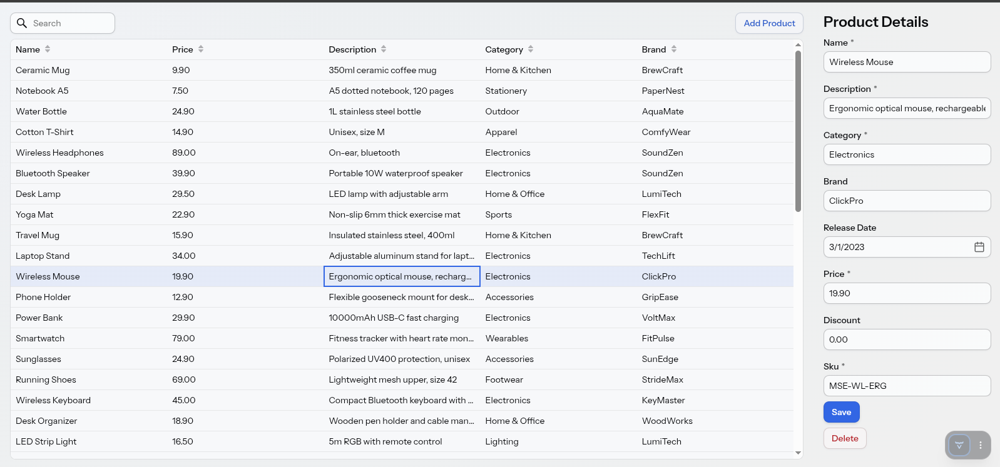
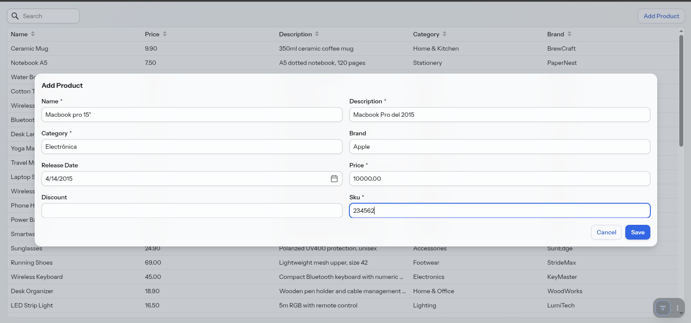
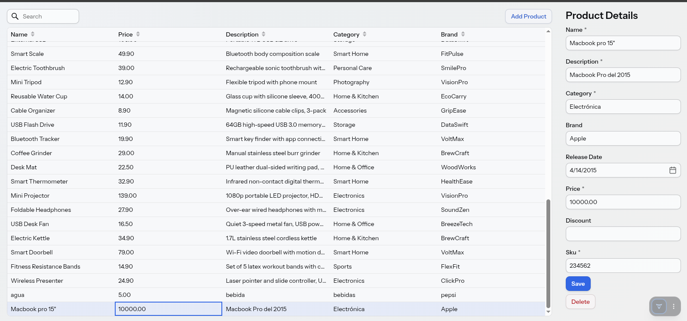

# 📦 Product Catalog Management System

A robust and responsive CRUD application for managing a product catalog, built with **Java, Spring Boot, and Vaadin**.

## 🎓 Academic Context

This repository contains the learning outcomes (Resultado de Aprendizaje) for the **Object-Oriented Programming** course. It was developed as part of the **Desarrollo de Software Multiplataforma** degree at **Universidad Tecnológica del Sureste de Veracruz**.

The development of this project was guided and supervised by the course professor to demonstrate the practical application of OOP principles, modern UI integration, and relational database management.


## 📸 Screenshots

<!-- Ensure you change 'captura-1.png', etc. to the actual names of your image files -->

*Main grid view of products featuring real-time search functionality.*


*Pop-up dialog containing the form for registering a new product.*


*Visual confirmation showing the newly added product successfully integrated and visible within the catalog.*

## ✨ Features

- **Full CRUD Operations**: Create, Read, Update, and Delete products seamlessly.
- **Real-time Search & Filtering**: Instantly filter catalog items by name.
- **Robust Data Validation**: Built-in error handling for duplicate SKUs and missing required fields.
- **Optimistic Locking**: Prevents data overwriting conflicts when multiple sessions edit the same product.
- **Responsive UI**: Modern, accessible interface powered by Vaadin Flow and Lumo styling.

## 🛠️ Tech Stack

- **Backend**: Java, Spring Boot, Spring Data (JDBC/R2DBC)
- **Frontend**: Vaadin Flow
- **Database**: SQL (Pre-configured schema and seed data)
- **Environment**: Developed and tested on Linux (Fedora)

## 🚀 Getting Started

### Prerequisites
- Java 17 or higher
- Maven
- IntelliJ IDEA (or your preferred IDE)

### Running the Application

1. Clone this repository to your local machine:
   ```bash
   git clone <your-repo-url>
   ```
2. Navigate to the project directory:
   ```bash
   cd <your-project-directory>
   ```
3. Run the application using Maven:
   ```bash
   mvn spring-boot:run
   ```
4. Open your browser and navigate to `http://localhost:8080`.

## 👨‍💻 Contributors

- **Juan Carlos García Flores** - *Student Developer*
- Developed under the guidance of the course professor.